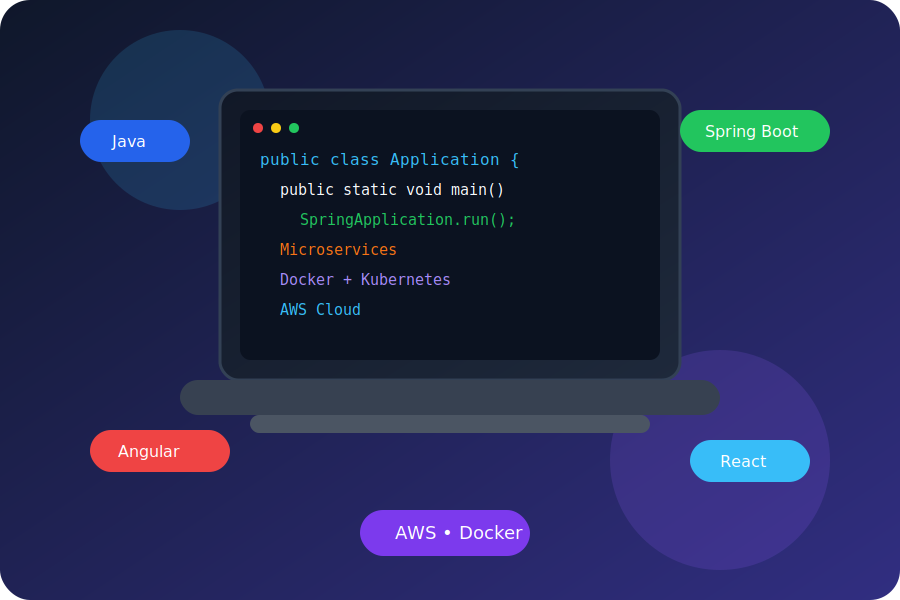

# 👋 Hi, I'm Rahul Moundekar

> Senior Java Full Stack Developer | Java | Spring Boot | Microservices | Angular | React | AWS


---

# Hero Banner

<p align="center">

</p>

<p align="center">

</p>

# Animated Typing

<p align="center">

[](https://github.com/rahulmoundekar)

</p>

<p align="center">

<a href="https://github.com/rahulmoundekar">

</a>

<!-- Replace the URL below with your actual LinkedIn profile -->
<a href="https://www.linkedin.com/">

</a>

</p>

# About Me

- 💼 Senior Java Full Stack Developer
- ☕ Java, Spring Boot, Microservices
- ⚛️ Angular & React
- ☁️ AWS, Docker, Kubernetes
- 📍 Pune, India

# Tech Stack

## Backend
- Java 8/17/21
- Spring Boot
- Spring Security
- Hibernate
- REST APIs

## Frontend
- Angular
- React
- TypeScript

## Databases
- MySQL
- Oracle
- MongoDB
- Redis

## DevOps
- Docker
- Kubernetes
- Jenkins
- GitHub Actions

## Cloud
- AWS EC2
- S3
- RDS

<!-- End of Part 1 -->
---

# 📊 GitHub Analytics

<div align="center">


</div>

---

# 🔥 Contribution Streak

<div align="center">


</div>

---

## 📈 Contribution Graph

<p align="center">

</p>

---

# 🏆 GitHub Trophies

<div align="center">


</div>

---

## 🐍 Contribution Snake

<p align="center">
  
</p>

---


---

# 📊 GitHub Metrics

<p align="center">
  
</p>

---

## 🏆 GitHub Trophy

<p align="center">

</p>


## 📊 GitHub Stats

<p align="center">


</p>

<p align="center">


</p>

# 💻 Daily Development

<div align="center">

| Category | Focus |
|-----------|-------|
| ☕ Backend | Java 21, Spring Boot |
| ⚛ Frontend | Angular, React |
| ☁ Cloud | AWS |
| 🐳 Containers | Docker |
| ☸ Orchestration | Kubernetes |
| 🧪 Testing | JUnit, Mockito |
| 🔁 CI/CD | Jenkins, GitHub Actions |

</div>

---

# ⚡ Enterprise Skills

```text
✔ Java 8 / 17 / 21

✔ Spring Boot

✔ Spring Security

✔ Spring Data JPA

✔ Hibernate

✔ REST APIs

✔ Microservices

✔ Kafka

✔ Redis

✔ MongoDB

✔ Docker

✔ Kubernetes

✔ AWS

✔ Angular

✔ React

✔ Git

✔ Jenkins

✔ SonarQube

✔ Maven
```

---

# 🧠 System Design Topics

- API Gateway
- Service Discovery
- Circuit Breaker
- Rate Limiting
- Distributed Cache
- Event-Driven Architecture
- CQRS
- Saga Pattern
- Resilience4j
- OAuth2 & JWT
- OpenAPI / Swagger
- Horizontal Scaling

---

# 🚀 Current Focus

- Spring AI
- LangChain4j
- AI Agents
- MCP Servers
- AWS Architecture
- Kubernetes
- System Design
- High-Performance Java
- Generative AI

---