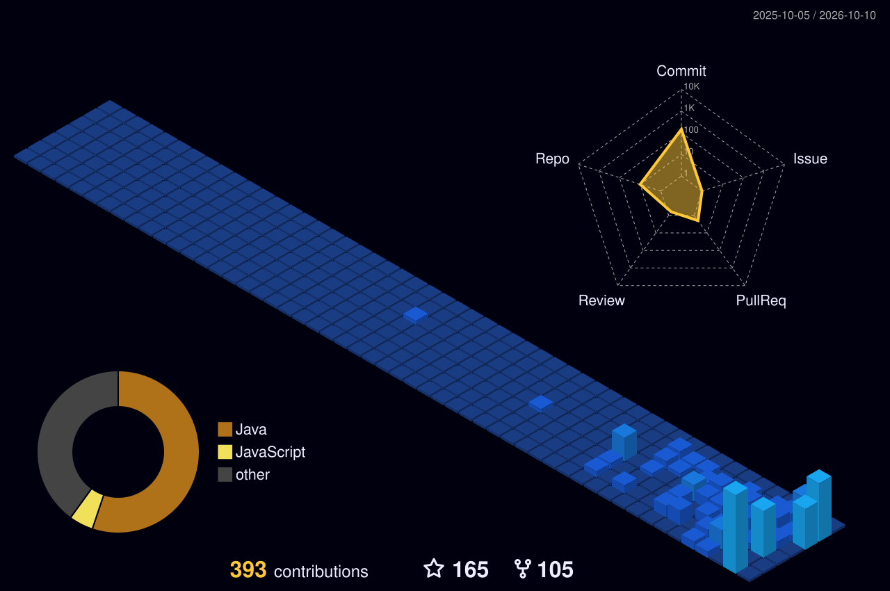

<!-- 🎬 HERO -->

  

<!-- 🧑‍💻 ABOUT + LIFE -->

  

<!-- 🧰 TECH STACK -->

  

<!-- 🪪 DEVELOPER ID + DASHBOARD -->

 

<a href="./docs/architecture.md"><strong>🏗️ Read the Architecture Portfolio</strong></a>
&nbsp;&nbsp;•&nbsp;&nbsp;
<a href="./docs/project-map.md"><strong>🗺️ Explore the Project Map</strong></a>

  

## 🚀 Featured builds

| Project | What it is | Stack |
|:---|:---|:---|
| [**Payment Idempotent Ledger**](https://github.com/rahulmoundekar/payment-idempotent-ledger) | Payment correctness under retries and concurrency, with double-entry accounting | `Java` `Spring Boot` `PostgreSQL` `JPA` |
| [**Auth Token Service**](https://github.com/rahulmoundekar/auth-token-service) | Multi-tenant authentication with rotating refresh tokens, RBAC and PostgreSQL RLS | `Java 21` `Spring Security` `PostgreSQL` `Flyway` |
| [**Event-Driven Notification Service**](https://github.com/rahulmoundekar/event-driven-notification-service) | Reliable event processing with transactional outbox, Kafka, retries and DLT | `Java 21` `Kafka` `PostgreSQL` `Prometheus` |
| [**Webhook Delivery Service**](https://github.com/rahulmoundekar/webhook-delivery-service) | Asynchronous signed delivery with retries, jitter and dead-letter recovery | `Java 21` `Spring Boot` `Redis` `HMAC` |
| [**Full-Text Search API**](https://github.com/rahulmoundekar/fulltext-search-api) | PostgreSQL-native search with relevance ranking and fuzzy fallback | `Java 21` `Spring Boot` `PostgreSQL` `pg_trgm` |
| [**Real-Time Notification Service**](https://github.com/rahulmoundekar/realtime-notification-service) | Durable notifications with Redis fan-out and WebSocket/SSE delivery | `Java 21` `Redis` `WebSocket` `SSE` |

 

## 🌃 My contribution city

*Every contribution becomes another part of the engineering skyline — generated automatically.*

  

<!-- 💌 CONNECT -->

  

*Always learning, always building — with a bias toward secure, reliable systems.*

