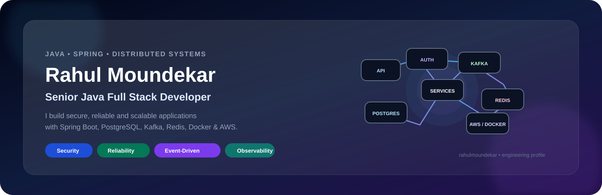
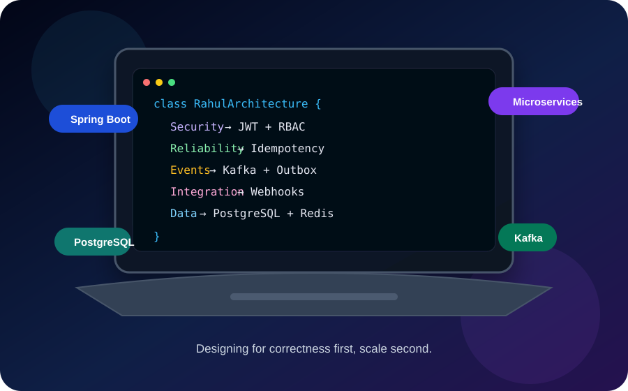
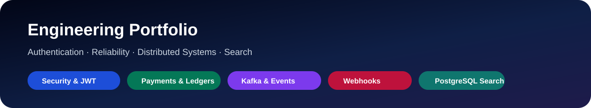
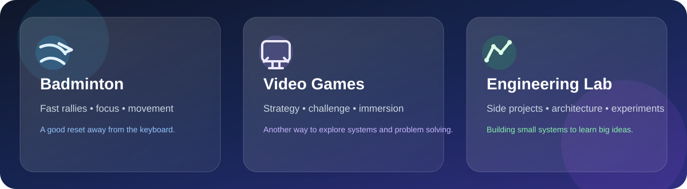

<!-- PROFILE HERO -->
<p align="center">
  
</p>

<p align="center">
  <a href="https://github.com/rahulmoundekar">
    
  </a>
  <a href="https://www.linkedin.com/in/rahul-moundekar/">
    
  </a>
</p>

<p align="center">
  
</p>

---

## 👋 About Me

<table>
  <tr>
    <td width="52%" valign="top">
      <h3>Senior Java Full Stack Developer</h3>
      <p>
        I build backend-heavy, production-oriented applications with <strong>Java + Spring Boot</strong>,
        with a strong focus on <strong>security, reliability, transaction safety, event-driven architecture
        and scalable APIs</strong>.
      </p>
      <p>
        My side projects are a practical engineering lab: I use them to explore system design,
        distributed systems, database correctness, observability and modern AI tooling.
      </p>
      <p>
        <strong>Primary stack:</strong> Java · Spring Boot · Spring Security · PostgreSQL · Kafka · Redis · Docker · AWS
      </p>
    </td>
    <td width="48%" align="center">
      
    </td>
  </tr>
</table>

---

## 🧭 What I Build

<p align="center">
  
</p>

<table>
  <tr>
    <td align="center"><strong>🔐 Secure</strong><br/>JWT · RBAC · tenant isolation</td>
    <td align="center"><strong>💳 Reliable</strong><br/>Idempotency · transactions · ledgers</td>
    <td align="center"><strong>📨 Distributed</strong><br/>Kafka · outbox · DLT</td>
    <td align="center"><strong>🔗 Integrated</strong><br/>Webhooks · queues · retries</td>
  </tr>
</table>

---

## 🚀 Featured Engineering Work

<table>
  <tr>
    <td width="50%" valign="top">
      <h3>🔐 SSO Service <sup>PRIVATE</sup></h3>
      <p>Reusable authentication boundary for applications and microservices.</p>
      <p><strong>Spring Boot · Spring Security · JWT · Microservices</strong></p>
      <a href="https://github.com/rahulmoundekar/sso-service">View repository →</a>
    </td>
    <td width="50%" valign="top">
      <h3>🏫 Institute Management <sup>PRIVATE</sup></h3>
      <p>Full-stack institute management platform with enterprise administration workflows.</p>
      <p><strong>Java · Spring Boot · Angular · PostgreSQL</strong></p>
      <a href="https://github.com/rahulmoundekar/institute-management">View repository →</a>
    </td>
  </tr>
  <tr>
    <td width="50%" valign="top">
      <h3>💳 Payment Idempotent Ledger</h3>
      <p>Payment API built around idempotency, serializable transactions and double-entry accounting.</p>
      <p><strong>Java · Spring Boot · PostgreSQL · JPA</strong></p>
      <a href="https://github.com/rahulmoundekar/payment-idempotent-ledger">View repository →</a>
    </td>
    <td width="50%" valign="top">
      <h3>🛡️ Auth Token Service</h3>
      <p>Multi-tenant auth platform with JWT, rotating refresh tokens and database-level tenant isolation.</p>
      <p><strong>Java 21 · Spring Security · PostgreSQL · Flyway</strong></p>
      <a href="https://github.com/rahulmoundekar/auth-token-service">View repository →</a>
    </td>
  </tr>
  <tr>
    <td width="50%" valign="top">
      <h3>📨 Event-Driven Notification</h3>
      <p>Reliable event workflow using transactional outbox, Kafka, idempotent consumers, retries and DLT.</p>
      <p><strong>Spring Boot · Kafka · PostgreSQL · Prometheus</strong></p>
      <a href="https://github.com/rahulmoundekar/event-driven-notification-service">View repository →</a>
    </td>
    <td width="50%" valign="top">
      <h3>🔗 Webhook Delivery Service</h3>
      <p>Signed asynchronous webhook delivery with retries, jitter, delivery history and dead-letter recovery.</p>
      <p><strong>Spring Boot · Redis · PostgreSQL · HMAC</strong></p>
      <a href="https://github.com/rahulmoundekar/webhook-delivery-service">View repository →</a>
    </td>
  </tr>
</table>

<p align="center">
  <a href="https://github.com/rahulmoundekar?tab=repositories">Explore all repositories →</a>
</p>

---

## 🧰 Tech Stack

<p align="center">
  
</p>

<details>
<summary><strong>Core technologies</strong></summary>
<br/>

**Backend:** Java 8/17/21 · Spring Boot · Spring Security · Hibernate · REST APIs · JPA

**Frontend:** Angular · React · TypeScript

**Data:** PostgreSQL · MySQL · MongoDB · Redis

**Messaging & Integration:** Kafka · Redis queues · Webhooks · Event-driven architecture

**DevOps & Cloud:** Docker · Kubernetes · GitHub Actions · Jenkins · AWS

**Engineering:** API design · concurrency · transaction management · observability · system design

</details>

---

## 🤖 AI & Current Exploration

I’m extending my backend engineering toolkit into modern AI application development:

<p align="center">
  
  
  
  
  
</p>

---

## 🧠 System Design Themes

```text
API Gateway        → Service Discovery     → Resilience
OAuth2 / JWT       → RBAC                  → Tenant Isolation
Idempotency        → Distributed Locks     → Transaction Safety
Transactional Outbox → Kafka               → Idempotent Consumers
Retries + DLT      → Observability         → Recovery
PostgreSQL         → Search Indexing       → Performance
```

---

## 🎮 Outside the IDE

<p align="center">
  
</p>

---

## 📊 GitHub Activity

<p align="center">
  
  
</p>

<p align="center">
  
</p>

<p align="center">
  
</p>

---

## 🐍 Contribution Snake

<p align="center">
  
</p>

---

## 📫 Connect

<p align="center">
  <a href="https://github.com/rahulmoundekar">
    
  </a>
  <a href="https://www.linkedin.com/in/rahul-moundekar/">
    
  </a>
</p>

<p align="center">
  <em>Build useful systems. Understand the trade-offs. Keep learning.</em>
</p>

<p align="center">
  
</p>
